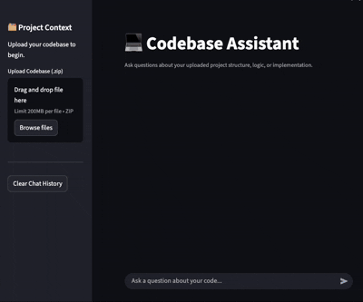

# CodeMind 🧠 
<div align="center">

### Structural Code Intelligence with AST-Powered RAG

> **CodeMind is not a generic LLM wrapper.** > **It is a structural, code-aware RAG system that understands your codebase the way a senior engineer does.**

[](https://www.python.org/)
[](https://fastapi.tiangolo.com/)
[](https://qdrant.tech/)
[](https://streamlit.io/)

</div>

## ⚡ What is CodeMind?



**CodeMind** is an AI-powered assistant that enables natural-language querying over real-world codebases with **high precision and zero hallucination**.

Unlike standard RAG systems that treat code as plain text, CodeMind **preserves code structure**, reconstructs full logical units, and answers **only using verified code context**.

<br clear="right"/>
---

## Why CodeMind is Different

### ❌ Typical Code RAG Systems
- Random token chunking  
- Broken functions & methods  
- Lost class context  
- Hallucinated logic  
- Poor scalability  

### ✅ CodeMind’s Structural RAG
CodeMind treats code as **structured data**, not text.

> **RAG is a data engineering problem — CodeMind solves it structurally.**

---

##  Core Capabilities

### 🧠 AST-Driven Code Parsing
Leverages Python’s native `ast` module to traverse syntax trees and extract:
- `ClassDef`
- `FunctionDef`
- `AsyncFunctionDef`
- Class methods
- Module-level code  

Parent-child relationships are preserved to enable **accurate contextual reconstruction**.

---

### 🧱 Semantic Code Chunking
- Code is chunked by **logical boundaries**, not token limits  
- Large functions are safely split  
- All splits remain symbol-linked for reconstruction  

---

### 🔁 Smart Reconstruction
- Split chunks are **reassembled before LLM inference**  
- The model always sees **complete functions or methods**  
- Eliminates partial-context hallucinations  

---

### 🏗️ Class-Aware Retrieval
- Class methods automatically attach their class headers  
- Missing headers are dynamically fetched  
- Ensures state and design context is preserved  

---

### 🎯 Symbol-Level Deduplication
- Results are grouped by `symbol`  
- Prevents duplicate fragments  
- One symbol → one coherent context block  

---

### 📦 Context Budget Enforcement
- Retrieved chunks are scored, sorted, and trimmed  
- Guarantees LLM context limits are respected  
- Works on large codebases  

---

## 🏗️ Architecture


## 🛠️ Tech Stack
### Backend

- Python 3.10+

- FastAPI

- Python AST

- SentenceTransformers (nomic-embed-text-v1.5)

- Qdrant

### Frontend

- Streamlit (intentionally minimal)

## ▶️ How to Run

### Prerequisites
* Python 3.10+
* Docker (for Qdrant)
* Git

### 1️⃣ Clone Repository
```bash
git clone https://github.com/Prithvi1247/RAG-Coding-Assistant
cd CodeMind
```
### 2️⃣ Create Virtual Environment
```Bash

python -m venv venv

# Mac/Linux:
source venv/bin/activate

# Windows (Command Prompt):
venv\Scripts\activate
```
### 3️⃣ Install Dependencies
```Bash

pip install -r requirements.txt
```
### 4️⃣ Start Qdrant
```Bash

docker run -p 6333:6333 qdrant/qdrant
```
### 5️⃣ Start Backend
```Bash

uvicorn backend.main:app 
```
### 6️⃣ Start Frontend
```Bash

streamlit run frontend/app.py
```

## Technical Challenges Solved
- Handling Async AST Nodes

- Python’s AST represents async functions differently (AsyncFunctionDef).
  
- Ensuring consistent extraction and reconstruction across sync/async functions required separate traversal logic and symbol normalization.

- Class Context Reconstruction

- Class headers and methods are indexed separately for retrieval quality, then re-attached at query time — balancing recall accuracy with context integrity.

- Chunk Explosion Control

- Symbol-level deduplication was required to prevent redundant chunks from overwhelming the LLM context window.

## Roadmap

- Multi-language support

- Dependency graph reasoning

- Call-chain tracing

- IDE plugin

## Why This Matters

- Faster onboarding

- **Zero** hallucination risk

- Private codebase safe

- Scales to **large repos**

- Designed like a **production system** 

### Built Focused on structural correctness, data engineering, and production-grade AI systems.

> **CodeMind doesn’t just retrieve code.** 
> **It reconstructs intent.** 
